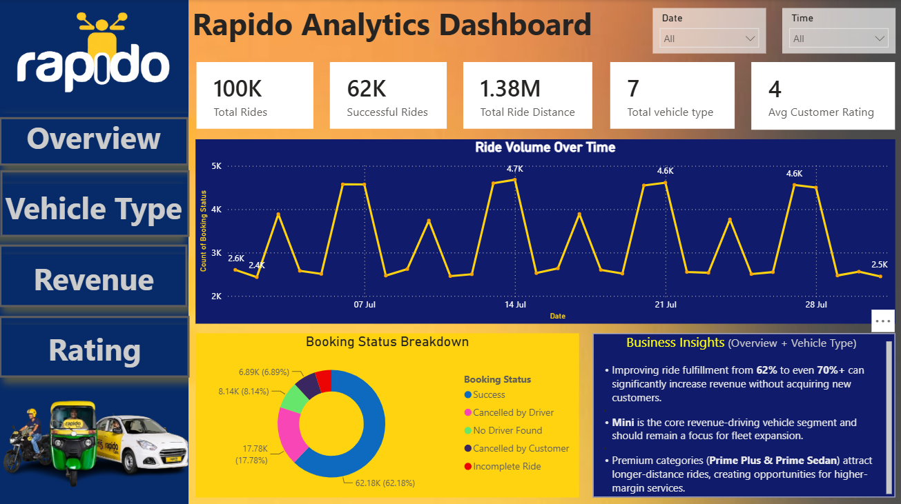
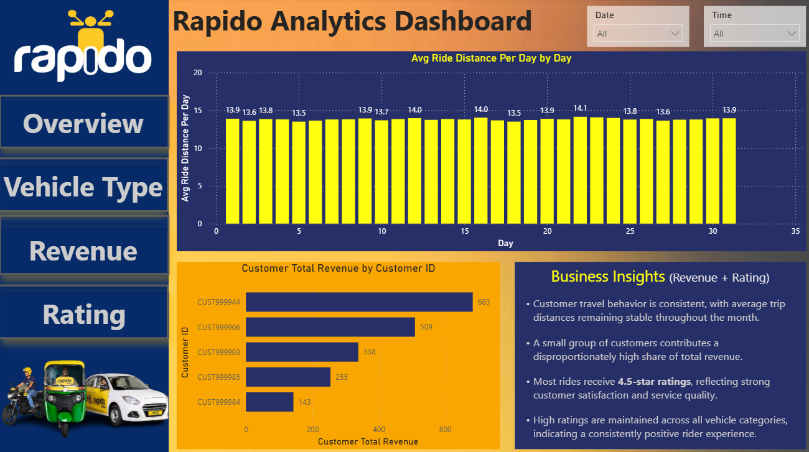

# Rapido Ride Analytics

An end-to-end Data Analytics project focused on analyzing ride bookings, cancellations, revenue, customer ratings, and operational performance using SQL, Excel, and Power BI.

## Tech Stack

- SQL (MySQL)
- Excel
- Power BI

## Business Problem

The business lacked visibility into:

- Ride cancellations
- Revenue performance
- Customer and driver ratings
- Vehicle-wise performance
- Demand trends across locations

## Project Workflow

1. Cleaned and prepared data using Excel.
2. Performed business analysis using SQL.
3. Built an interactive Power BI dashboard.
4. Generated actionable business insights.

## Key Analysis

- Booking Status Analysis
- Cancellation Analysis
- Revenue Analysis
- Customer & Driver Ratings
- Vehicle Performance
- Peak Demand Hours
- Location-Based Demand

## Dashboard Features

- Ride Volume Trends
- Booking Status Breakdown
- Revenue by Vehicle Type
- Cancellation Insights
- Ratings Overview
- KPI Cards

## Key Insights

- Customer cancellations exceeded driver cancellations.
- Premium vehicle categories generated higher revenue.
- Morning hours had the highest booking demand.
- A few locations contributed most bookings.

## Files
Rapido-Ride-Analytics
│
├── Dataset
│   └── rapido_ride.csv
│
├── SQL
│   └── rapido_sql_analysis.sql
│
├── Dashboard
│   └── rapido_analytics_dashboard.pbix
│
├── Presentation
│   └── Rapido_Analytics_Presentation.pptx
│
└── README.md

## Dashboard Preview

## Author

**Abhishek Kumar**

SQL | Excel | Power BI | Data Analytics
